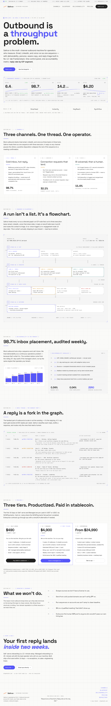

# Cadence — outbound-sales-machines

> The multi-channel outbound machine for operators who measure. Email, LinkedIn, and voice — one sequence, one accountability metric.

## Live

| Surface | URL |
|---------|-----|
| Landing | https://outbound-sales-machines.prin7r.com |
| Notion opportunity | https://www.notion.so/3543ceec261981a58ec0f7740a19be83 |
| Repo | https://github.com/prin7r-projects/outbound-sales-machines |



## Repo structure

```
.
├── DESIGN.md                          # Canonical design + style guide (15 sections)
├── README.md                          # this file
├── apps/
│   ├── landing/                       # Next.js 15 + ShadCN-baseline marketing site (Wave 2 — shipped)
│   │   ├── app/
│   │   │   ├── layout.tsx
│   │   │   ├── page.tsx               # 9 sections: masthead → hero → channels → blueprint → deliverability → triage → pricing → covenant → closer
│   │   │   ├── pricing-cta.tsx        # NOWPayments checkout client component
│   │   │   ├── globals.css            # Brand tokens + utilities
│   │   │   ├── icon.svg               # Favicon (6-point line graph)
│   │   │   └── api/
│   │   │       ├── checkout/nowpayments/route.ts   # POST /api/checkout/nowpayments
│   │   │       └── webhooks/nowpayments/route.ts   # IPN webhook (HMAC-SHA512 verified)
│   │   ├── lib/
│   │   │   ├── env.ts                 # MissingEnvError + optionalEnv helpers
│   │   │   └── nowpayments.ts         # PLANS + createNowpaymentsInvoice + verifyNowpaymentsIpn
│   │   ├── public/robots.txt
│   │   ├── tailwind.config.ts
│   │   ├── next.config.mjs            # output: 'standalone'
│   │   ├── package.json
│   │   └── tsconfig.json
│   └── app/                           # Open-SaaS fork target (Wave 2 — stub only)
│       ├── README.md                  # Fork plan + next-wave scope
│       └── .gitkeep
├── docs/
│   ├── 01-brand-identity.md
│   ├── 02-architecture.md
│   ├── 03-user-journeys.md
│   ├── 04-pain-points.md
│   ├── 05-audience-profile.md
│   ├── 06-sales-channels.md
│   ├── 07-sales-strategy.md
│   ├── 08-marketing-strategy.md
│   ├── 09-go-to-market.md
│   ├── 10-pitch-deck.md
│   ├── pitch-deck.html                # Self-contained, branded, opens directly in a browser
│   └── screenshots/
│       ├── landing-desktop.png
│       └── landing-mobile.png
├── scripts/
│   └── capture-landing-screenshots.mjs  # Playwright capture, re-run after landing changes
├── .github/workflows/landing-build.yml  # CI: validates `pnpm build` on every PR to main
├── Dockerfile.landing                  # Multistage Next.js standalone build
├── docker-compose.yml                  # Single landing service with Traefik labels
├── .env.example                        # NOWPayments + Reown + merchant address vars (no secrets)
├── .gitignore
└── LICENSE
```

## Dev quickstart (landing)

```bash
cd apps/landing
pnpm install
cp ../../.env.example .env.local      # populate NOWPAYMENTS_API_KEY for live checkout testing
pnpm dev                              # http://localhost:3000
pnpm build                            # validates the standalone build
```

## Production deploy

The landing runs on `storage-contabo` (root@161.97.99.120) under Traefik (host network mode, `letsencrypt` resolver). Deploy:

```bash
ssh storage-contabo
cd /opt/prin7r-deploys/outbound-sales-machines
git pull
docker compose build
docker compose up -d
curl -sI https://outbound-sales-machines.prin7r.com    # expect HTTP/2 200
```

The `.env` on the server lives at `/opt/prin7r-deploys/outbound-sales-machines/.env` (gitignored). It contains live `NOWPAYMENTS_API_KEY` + `NOWPAYMENTS_IPN_SECRET` + `NEXT_PUBLIC_SITE_URL`.

## Stack

- Next.js 15 (App Router, standalone output)
- React 19 + TypeScript 5
- Tailwind CSS 3.4 + custom token layer (no shadcn imports yet — see `DESIGN.md` §3)
- NOWPayments hosted invoice + IPN (HMAC-SHA512)
- Docker + Traefik on Coolify-adjacent host

## Brand

See [`DESIGN.md`](DESIGN.md) for the full style guide. One-line summary:

> Industrial blueprint aesthetic — graphite (#0E1014) + safety-orange (#F26B1F) + JetBrains Mono labels. Three-channel sequence engine treated as a directed graph, with reply-rate (not "pipeline") as the only ego.

## License

MIT — see `LICENSE`.
