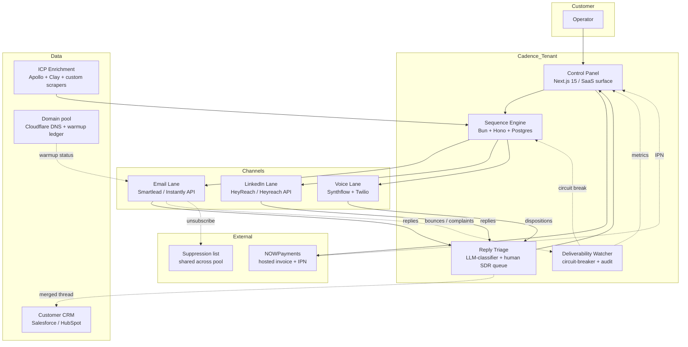

# 02 — Architecture

> The shape of the system that runs Cadence — components, data flows, deploy topology.

## System diagram

## Components

| Component | Stack | Responsibility |
|-----------|-------|----------------|
| **Control Panel** | Next.js 15 App Router, ShadCN, Tailwind | Operator UI: build sequences, view runs, see reply triage queue, configure billing. |
| **Sequence Engine** | Bun + Hono + Postgres + Redis | Orchestrates the directed graph of sequence steps. Holds run state, fan-out, fan-in. Idempotent step execution. |
| **Reply Triage** | LLM classifier (Claude Haiku 4.5) + human SDR pod | Classifies incoming replies (positive / objection / not-now / hard-no). Drafts replies for human send. |
| **Deliverability Watcher** | Bun worker + InfluxDB | Polls bounce/complaint rates from Smartlead/Instantly APIs, runs daily inbox-placement test from a control mailbox per pool, trips a circuit breaker if thresholds exceeded. |
| **Domain pool** | Cloudflare DNS API + warmup ledger (Postgres) | Maintains the SPF/DKIM/DMARC posture for every domain in the pool, tracks warmup days, rotates send mailboxes. |
| **ICP Enrichment** | Apollo API + Clay workflows + custom scrapers | 14-field enrichment pass: firmographic, trigger event, fund vintage, recent deployments, technology stack, hiring signals. |
| **Email lane** | Smartlead / Instantly | Send via warmed mailbox pools. Inbound parsed via webhook. |
| **LinkedIn lane** | HeyReach | Connection requests, follow-ups, voice notes. Uses real warmed accounts only. |
| **Voice lane** | Synthflow (AI voicemail) + Twilio (live SMS / human callback bridge) | 22-second AI voicemail in operator's voice clone; live answers route to human SDR within 60s. |
| **Customer CRM sync** | One-way: Cadence → SFDC/HubSpot | Merged thread digest, meeting confirmation, recording placeholder. |
| **NOWPayments** | Hosted invoice + IPN webhook | Self-serve / Managed checkout. HMAC-SHA512 signed callback. |

## Data flows

### Outbound run
1. Operator builds a sequence in the control panel; backed by JSON graph definition.
2. ICP source query runs on Clay + Apollo, returns enriched contacts (14 fields).
3. Sequence Engine fan-outs contacts to lane workers (email / LinkedIn / voice).
4. Lane workers respect rate caps (LinkedIn ≤22 connect requests / day / seat; email throttled by domain warmup status).
5. Daily 09:00 local: Deliverability Watcher publishes the placement metric to the operator's report.

### Reply triage
1. Inbound reply hits the lane webhook (email / LinkedIn / voice disposition).
2. LLM classifier scores: `positive` / `objection` / `not-now` / `hard-no`.
3. **Positive** → all lanes pause, calendar invite generated, CRM sync.
4. **Objection** → drafted reply sent to human SDR queue with full context.
5. **Not-now** → 14-day re-engage node armed.
6. **Hard-no** → unsubscribe + suppression list.

### Deliverability circuit breaker
- Bounce > 2.0% → pause that domain pool for 6h.
- Spam complaints > 0.1% → pause that domain pool for 24h, alert ops.
- 3+ pools tripping in a 24h window → pause the entire tenant, page ops via PagerDuty.

## Deploy topology (current Wave 2 scope)

| Surface | Platform | URL | Status |
|---------|----------|-----|--------|
| Marketing landing | Next.js standalone in Docker on `storage-contabo` (Traefik, host network mode) | https://outbound-sales-machines.prin7r.com | **Wave 2 — shipped** |
| SaaS app (Open-SaaS fork) | Wasp app planned in `apps/app/` | TBD (`app.outbound-sales-machines.prin7r.com`) | **Wave 2 — stub only**; full build next wave |
| Sequence Engine | Bun + Hono service, planned on `picoclaw-fleet` host | TBD (`api.outbound-sales-machines.prin7r.com`) | **Future wave** |
| NOWPayments hosted invoice | External (api.nowpayments.io) | n/a | Wired via `/api/checkout/nowpayments` |
| NOWPayments IPN | Inbound webhook → landing route | https://outbound-sales-machines.prin7r.com/api/webhooks/nowpayments | Implemented; HMAC-SHA512 verified |

## Future state

The Wave 2 scope ships only the marketing landing and stubbed SaaS folder. The sequence engine, reply triage, and deliverability watcher are scoped for the next two waves and are described here so reviewers understand where the landing fits.

Production architecture will run on Coolify on remote server `144.91.94.91` (server `144`) per the project default OpenClaw deployment pattern, with:
- Sequence Engine on Bun, behind an internal Traefik route.
- Postgres + Redis on the same host (initial); split out at $50k MRR.
- Deliverability worker as a long-running container with InfluxDB sidecar.
- Human SDR pod accessing the triage queue via the same control panel — no separate "agent dashboard."
