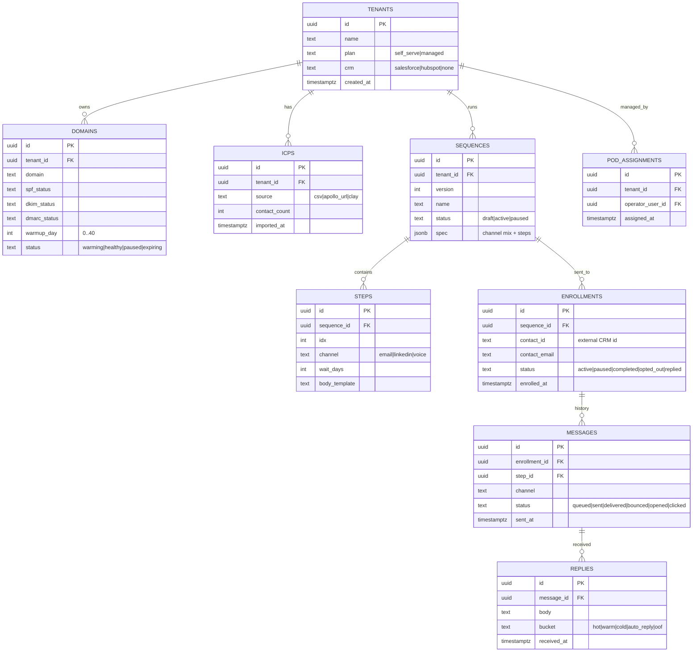

# 12 · Technical specification

> Saltrun = control panel + sequence engine + reply triage + deliverability watcher across email
> + LinkedIn + voice lanes. Wave 2 ships the landing + crypto checkout. Wave 3 ships the runtime.

## 1. Architecture overview

```mermaid
flowchart LR
  subgraph Edge[storage-contabo · Traefik]
    Tr[Traefik]
  end
  subgraph Landing[apps/landing · Next.js 15]
    L[Marketing + tier picker]
    CK[/api/checkout/nowpayments]
    WH[/api/webhooks/nowpayments]
  end
  subgraph App[apps/app · Wave 3 Wasp/Open-SaaS]
    CTRL[Control Panel]
    BUILDER[Sequence builder]
    DASH[Throughput dashboard]
  end
  subgraph Pipeline
    SEQ[Sequence engine · Bun + Hono]
    REPLY[Reply triage · LLM-classifier]
    DELIV[Deliverability watcher]
    POD[Pod operator queue · Managed tier]
  end
  subgraph Channels
    EMAIL[Email lane · Smartlead/Instantly]
    LI[LinkedIn lane · HeyReach]
    VOICE[Voice lane · Synthflow + Twilio]
  end
  subgraph Data
    PG[(Postgres)]
    R[(Redis · queues + warmup ledger)]
  end
  subgraph Ext
    NP[NOWPayments]
    PM[Postmark]
    SLACK[Slack]
    CRM[Salesforce / HubSpot]
    ICP[Apollo / Clay]
    DNS[Cloudflare DNS]
  end
  Tr --> L
  L --> CK --> NP --> WH
  CTRL --> BUILDER
  BUILDER --> SEQ
  SEQ --> EMAIL
  SEQ --> LI
  SEQ --> VOICE
  EMAIL --> DELIV
  LI --> DELIV
  DELIV --> SEQ
  EMAIL --> REPLY
  LI --> REPLY
  REPLY --> CRM
  POD --> CTRL
```

**Topology.** Single VPS (storage-contabo) with landing + app + DB + Redis. Channel APIs are
external. Domain DNS via Cloudflare (Saltrun manages records on customer-delegated zones).

## 2. Data model



Indexes: `domains.tenant_id`, `enrollments.sequence_id`, `messages.status`, `replies.bucket`.

## 3. API contracts

### Public

| Method | Path | Auth | Request | Response |
|---|---|---|---|---|
| POST | `/api/checkout/nowpayments` | none | `{plan}` | `{invoice_url}` |
| POST | `/api/webhooks/nowpayments` | HMAC-SHA512 | NOWPayments IPN | `{ok:true}` |

### Internal (Wave 3)

| Method | Path | Auth | Body |
|---|---|---|---|
| POST | `/api/v1/icps` | session | `{source, body}` |
| POST | `/api/v1/sequences` | session | `{spec}` |
| POST | `/api/v1/sequences/:id/launch` | session | `{}` |
| POST | `/api/v1/sequences/:id/pause` | session | `{}` |
| GET | `/api/v1/throughput` | session | — |
| POST | `/api/internal/replies/triage` | system | `{message_id, body}` |
| POST | `/api/internal/circuit/email/:domain` | system | `{action: "pause"\|"resume"}` |

## 4. Integrations

| 3rd-party | Auth | Rate | Fallback |
|---|---|---|---|
| Smartlead / Instantly | API key | per-account | Pause email lane; alert |
| HeyReach | API key | per-LI-account | Pause LI lane |
| Synthflow / Twilio | API key + Twilio SID | dial-rate | Voice lane circuit-breaker |
| Cloudflare DNS | API token | 1200/min | Manual DNS update |
| Apollo / Clay | API key | varies | CSV upload fallback |
| Salesforce / HubSpot | OAuth2 | tier | Queue + retry |
| Postmark | server token | 10k/day | Resend |
| Slack incoming webhook | URL | 1/sec | Email digest |
| LLM (Claude 4.7 + GLM 5.1) | API key | tier | Cross-LLM fallback for reply classifier |
| NOWPayments | x-api-key + IPN HMAC | 100 RPM | Manual invoice |

## 5. Storage

- Postgres 16 (multi-tenant; row-level security on `tenant_id`).
- Redis 7 for queue + warmup ledger.
- Retention: messages 12 months hot, 24 months archive. PII (contact emails, replies) follows
  GDPR/CCPA delete-on-request.
- Audit log: every sequence launch, every circuit-breaker event, every refund.

## 6. Auth

- **Wave 2:** none.
- **Wave 3:** Wasp magic-link. Roles: `tenant_admin`, `tenant_user`, `pod_operator`, `prin7r_admin`.
- OAuth handshake for Salesforce/HubSpot/LinkedIn lanes per tenant.

## 7. Security

- Secrets in `.env` + per-tenant encrypted in DB (libsodium).
- Rate limits: sequence launch 30/hr/tenant; ICP import 5/day.
- Multi-tenant isolation: row-level security in Postgres; query-level enforcement in API.
- Audit log on every refund, every circuit-breaker, every CRM credential rotate.
- IPN HMAC; idempotent on `(payment_id, payment_status)`.

## 8. Observability

- Pino JSON logs → Loki.
- Metrics: `saltrun.sequence.completion_rate`, `saltrun.deliverability.bounce_rate_p1d`,
  `saltrun.replies.bucket_count`, `saltrun.warmup.day`, `saltrun.circuit.breaker_count`.
- Alerts: bounce rate > 3%; LI 4xx restricted; warmup stalled > 48h; pod queue > 5 for 1h.

## 9. Performance budgets

| Path | p50 | p95 |
|---|---|---|
| Sequence launch (1k contacts) | 4s | 12s |
| Reply triage classify | 600ms | 2s |
| Throughput dashboard load | 600ms | 1.5s |
| CRM upsert | 800ms | 2s |
| Circuit-breaker decision | 100ms | 300ms |
| Voice lane place call | 1.5s | 4s |

Throughput: 50 tenants per VPS; 200k messages/day cluster-wide.

## 10. Non-goals

- No IP rotation to evade complaints.
- No LinkedIn auto-connect bypassing LI per-day limits.
- No support for non-Salesforce / non-HubSpot CRMs natively (Zapier bridge only, Wave 4).
- No customer-uploaded "spam-template" mode.
- No referral / affiliate.
- No on-prem self-host (cloud-managed only).
